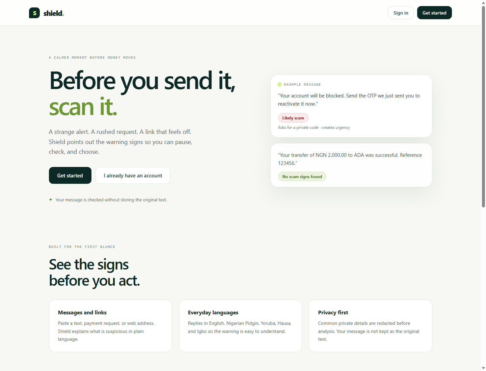
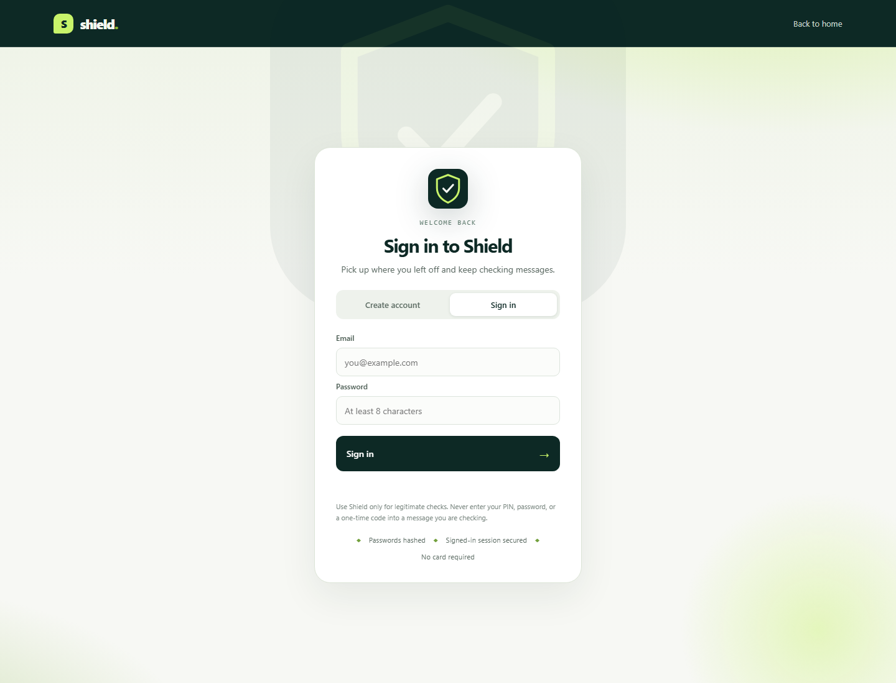
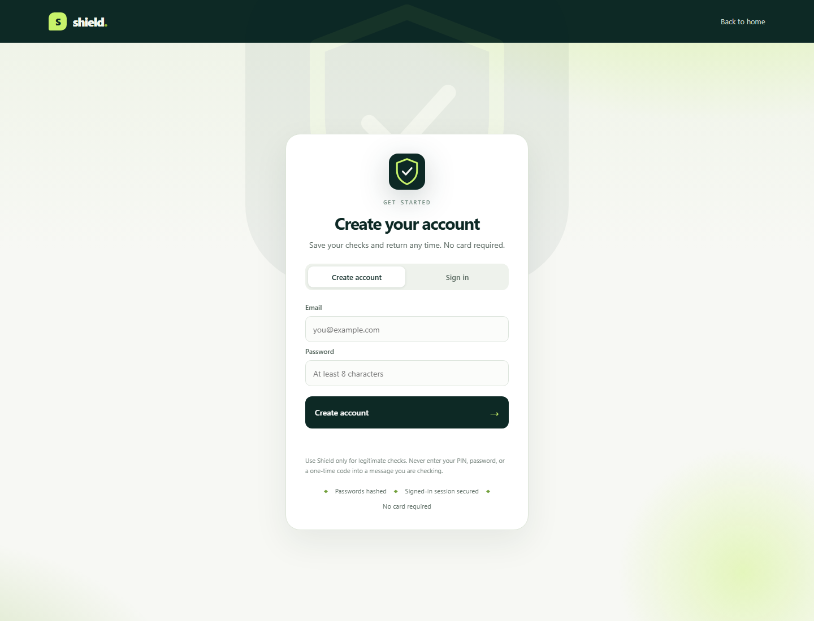
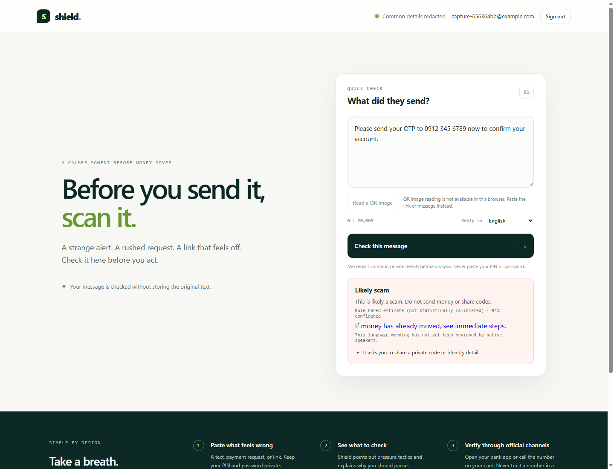
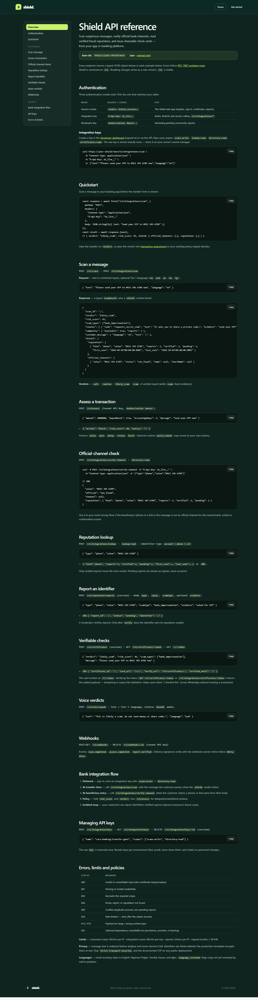

<div align="center">

<h1>Shield</h1>
<p><strong>Scan the message before you trust it.</strong></p>
<p>
<a href="https://github.com/opeblow/shield/actions/workflows/ci.yml"></a>
<a href="https://nodejs.org"></a>
<a href="https://www.typescriptlang.org"></a>
<a href="#verification"></a>
<a href="#verification"></a>
<a href="#verification"></a>
<a href="#licence"></a>
<a href="CONTRIBUTING.md"></a>
</p>
</div>

### Landing page

<p align="center">
<a href="docs/screenshots/shield-landing.png"></a>
</p>

The **landing page** is the store-front: it introduces Shield, sets expectations that a scan is a signal and never proof, and walks through a simple pre-scan flow — paste what feels wrong, see what to check, then verify through your bank's official channel. From here, **Get started** creates an account and **Sign in** returns existing users.

### Sign in

<p align="center">
<a href="docs/screenshots/shield-signin.png"></a>
</p>

Have an account already? The **Sign in** page takes your email and password, verifies them, and opens a secure session that keeps the scanner private to you.

### Get started

<p align="center">
<a href="docs/screenshots/shield-get-started.png"></a>
</p>

New here? The **Get started** (Create account) page sets up your Shield account. Pick a password of at least 8 characters; it is stored only as a hash, never in plain text.

### Scan

<p align="center">
<a href="docs/screenshots/shield-scan.png"></a>
</p>

Once signed in you land on the **Scan** page. Paste the suspicious message, link, or payment request and press **Check this message**. Shield redacts common private details, surfaces pressure tactics and secret-code requests, and returns a plain-language verdict — a red **Likely scam** here. A result is a signal to verify through an official channel, never proof that a message is safe. Results can be read in your language too: the reply selector offers **English, Nigerian Pidgin, Yorùbá, Hausa, and Igbo**.

Each scan also carries a **shared intelligence** block: which reported numbers or accounts already carry verified community reports, and whether a phone or link in the message is an official bank or telco channel (e.g. GTBank's `08029000000` or `gtbank.com`). After a scan you can mint a **verifiable check card** — an HMAC-sealed certificate that independently verifies for 7 days and can be shared on WhatsApp without trusting a screenshot.

### API reference for banks

<p align="center">
<a href="docs/screenshots/shield-docs.png"></a>
</p>

The **API reference** at `/docs` is the bank-facing contract in the style of Stripe/Pydantic documentation: every endpoint, its JSON request and response, authentication mode, scopes, error table, and a step-by-step **bank integration flow**. The raw OpenAPI 3.1 file downloads from `/openapi.yaml`.

Banks integrate three ways:

1. **Scan at transfer time** — `X-Api-Key` (integration key) → `POST /v1/integrations/scan` returns the verdict plus `shield` reputation/official-channel context for the message the customer pasted.
2. **Verify official channels at beneficiary entry** — `POST /v1/integrations/verify-channel` tells you whether a phone or link is a registered bank/telco channel.
3. **Report and certify** — your customers can report identifiers for moderation; verified reports weight everyone's future scans, and `/v1/certificates` produces shareable verifiable checks.

Mint and revoke keys (scoped: `scans:write`, `lookup:read`, `directory:read`, `certificates:read`) from the signed-in **developer keys** page at `/integrations`. The raw key is shown exactly once.

Shield also ships as an **installable PWA**: the web manifest declares a share target (`/share`), so from your phone's share sheet you pick **Shield** and the pasted message arrives prefilled on the scan page (signing in first when needed). A **browser extension** under `extensions/browser/` adds a right-click *“Check selected text with Shield”* action and a popup that scans pasted messages using the same `X-Api-Key` integration keys.

Shield is a privacy-minded scanning service for suspicious messages. It applies explainable rules and, when configured, asks the OpenAI API for a structured assessment of redacted text. A result is a signal to verify through an official channel; it is never proof that a message is safe.

Repository: [github.com/opeblow/shield](https://github.com/opeblow/shield)

## Local setup

Requirements: Node.js 22 or newer and npm. No third-party account is needed to run the local rules-based scanner.

1. Clone the repository: `git clone https://github.com/opeblow/shield.git` then `cd shield`.
2. Copy `.env.example` to `.env` (PowerShell: `Copy-Item .env.example .env`). Leave external credentials blank for rules-only use.
3. Install dependencies: `npm install`.
4. Start the service and PWA: `npm run dev`.
5. Open `http://localhost:3001`. The landing page leads to **Get started** → an email/password sign-up or sign-in page → the guarded scanner at `/app`. Health checks are at `/healthz` and `/readyz`.
6. Run checks: `npm run typecheck`, `npm run lint`, `npm test`, and `npm run eval`.

For visual QA, start the app and run `npm run screenshots` in an environment with Microsoft Edge installed; it captures exact 390px and 1440px viewports into `docs/screenshots/`.

Add `OPENAI_API_KEY` and `OPENAI_MODEL` to the environment to enable the structured text assessment. Never use real customer data in development. With `REDIS_URL` blank, development uses a process-local rate limiter; production refuses to start without PostgreSQL and Redis. Without `DATABASE_URL`, scans are not persisted. Neither local mode is suitable for production traffic.

## Services and deployment status

`infra/docker-compose.yml` describes local PostgreSQL and Redis. To use PostgreSQL locally, set `POSTGRES_PASSWORD` and `DATABASE_URL` in `.env`, start Compose, then apply the migration in `infra/migrations/` (including `0004_auth.sql` for consumer accounts and sessions, `0005_trust.sql` for blind-indexed identifier reports and integration keys, and `0006_alert_waves.sql` for the fraud-wave ledger) to the isolated development database. The API has PostgreSQL persistence and Redis rate-limit adapters, but neither has been runtime-verified in this environment; queues, object storage, and account onboarding remain incomplete. Consumer email/password authentication works without a database via a process-local store that is only suitable for development, and stores sessions in an `HttpOnly` cookie. This repository is an active implementation and is not launch-ready. Do not expose it to public traffic.

Production requires managed PostgreSQL/Redis/object storage, TLS termination, a KMS-backed keyring, OpenAI account configuration, rate limiting and auth backed by shared infrastructure, monitoring, backups, and privacy/security review. These external dependencies have not been provisioned and this repository is not launch-ready.

## Product interfaces

- `POST /v1/scans` accepts JSON `{ "text": "...", "language": "en|pcm|yo|ha|ig" }` or combined `{ "inputs": [{ "type": "url" | "qr" | "phone" | "account" | ... , ... }] }`. `mode: "deep"` runs the fast pass first and returns `upgrade_url` for `GET /v1/scans/{id}/stream` (Server-Sent Events: `fast`, `deep`, `final`). Every scan response includes a `shield` block with reputation and official-channel context.
- `POST /v1/assess` scores a transfer against a risk policy and returns an `action` (`allow|warn|review|delay|block`) plus a localized customer message.
- `POST /v1/lookup` accepts an identifier in JSON (not a URL) and returns only public reputation aggregates when a configured database has data.
- `POST /v1/link-preview` fetches a public URL through the SSRF-safe fetcher and returns status, size, HTML title/meta description, and URL scam signals — it never executes page scripts or loads subresources.
- `POST /v1/batch/scan` scans 1–25 messages in one call (anonymous or `X-Api-Key` with `scans:write`) and returns each result with its `shield` context.
- `POST /v1/media/scan` accepts a raw image/document/audio upload, sniffs its magic bytes, rejects SVG/executables and mismatched declared types, and enforces per-kind size limits (8 MiB request ceiling). It validates the artifact without rendering it; the accompanying text is scanned via `/v1/scans`.
- `GET /v1/usage` reports tenant metering; `POST/GET/DELETE /v1/webhooks` manage signed subscriptions (HMAC-SHA256, replay protection, retry/backoff); `POST /v1/voice/speak` returns warning audio in a Tier 1 language and accepts a `provider` field (simulated or `openai` when configured); `GET /v1/voice/providers` lists the available synthesis backends.
- Fraud-wave alerts: moderators verifying several reports for the same identifier inside 30 minutes trigger a wave that is logged, dispatched as a `fraud_wave.detected` webhook event, and readable at `GET /v1/alerts/waves` (session required, 48-hour horizon).
- `GET /v1/ops/readiness` (session required) audits persistence, rate limiting, auth, speech, certificates, blind-index pepper, and TLS posture, returning `ready|degraded` plus recommendations.
- Community reputation lives under `/v1/reputation/`: `POST /v1/reputation/reports` submits an identifier for moderation, `POST /v1/reputation/lookup` reads blind-indexed aggregates, and `POST /v1/reputation/reports/{id}/decide` (moderator bearer key) verifies or rejects a pending report. Only verified reports weight verdicts; pending reports surface only as signals.
- Official-channel checks: `POST /v1/integrations/verify-channel` matches a phone or URL against the maintained bank/telco directory (`apps/api/src/directory.ts`).
- Check cards: `POST /v1/certificates` issues an HMAC-sealed certificate (7-day TTL); `GET /v1/certificates/{token}` and `GET /v1/integrations/certificates/{token}` verify it, and `/c/{token}` renders the shareable card.
- Integration keys: `POST/GET /v1/integration/keys` and `DELETE /v1/integration/keys/{id}` manage scoped `X-Api-Key` credentials; identical scan/lookup/verify endpoints live under `/v1/integrations/*` and authenticate with the key. Raw keys are shown once at creation; only hash previews are listable.
- `GET /healthz` reports process health; `GET /readyz` reports configured scan mode. The full contract is in `docs/openapi.yaml` and the browsable reference at `/docs` (download `openapi.yaml` from `/openapi.yaml`).
- `POST /v1/auth/register` and `POST /v1/auth/login` create or verify an email/password account and set an `HttpOnly` session cookie (`shield_session`); `GET /v1/auth/me` returns the signed-in user; `POST /v1/auth/logout` revokes the session. `GET /app` is served only with a valid session and redirects to `/auth` otherwise. Consumer accounts persist when `DATABASE_URL` is set (see `0004_auth.sql`); without it, development uses a process-local store.
- The TypeScript client is `packages/sdk/src/index.ts`; banks can embed `apps/web/public/snippet.js` on a transfer page to render the warning from `/v1/assess`.
- `/recovery.html` provides first-hour account-safety steps and links to current official CBN guidance checked in the dated `data/recovery.json` file.
- The scanner can decode a user-selected raster QR image locally in browsers that implement `BarcodeDetector`; decoded content is shown for review and submitted only when the user starts a scan. `apps/api/src/ingestion.ts` validates uploaded image/document/audio magic bytes, but full server-side media analysis is not yet wired to an endpoint. Warning audio is available via `POST /v1/voice/speak`.
- WhatsApp, SMS, USSD, and IVR simulators are in `packages/channels/`; they scan locally and never send messages to real subscribers.

## Project structure

```
├── .github/
│   └── workflows/
│       └── ci.yml
├── apps/
│   ├── api/
│   │   └── src/
│   │       ├── auth.ts
│   │       ├── certificates.ts
│   │       ├── context.ts
│   │       ├── directory.ts
│   │       ├── env.ts
│   │       ├── ingestion.ts
│   │       ├── integration.ts
│       │       ├── jobs.ts
│       │       ├── preview.ts
│       │       ├── provider.ts
│       │       ├── rate-limit.ts
│       │       ├── repository.ts
│       │       ├── reputation.ts
│       │       ├── server.ts
│       │       ├── validation.ts
│       │       └── waves.ts
│   └── web/
│       └── public/
│           ├── data/
│           │   └── recovery.json
│           ├── app.html
│           ├── app.js
│           ├── auth.html
│           ├── auth.js
│           ├── docs.html
│           ├── docs.js
│           ├── icon.svg
│           ├── index.html
│           ├── integrations.html
│           ├── integrations.js
│           ├── landing.js
│           ├── manifest.webmanifest
│           ├── qr.js
│           ├── recovery.html
│           ├── recovery.js
│           ├── share.html
│           ├── share.js
│           ├── snippet.js
│           ├── styles.css
│           └── sw.js
├── config/
│   └── brand.ts
├── docs/
│   ├── legal/
│   │   └── LEGAL_DRAFTS.md
│   ├── runbooks/
│   │   ├── BACKUP_RESTORE.md
│   │   ├── INCIDENT_RESPONSE.md
│   │   └── KEY_ROTATION.md
│   ├── screenshots/
│   │   ├── shield-desktop.png
│   │   ├── shield-docs.png
│   │   └── shield-mobile.png
│   ├── AI_DATA_HANDLING.md
│   ├── DEGRADED_MATRIX.md
│   ├── openapi.yaml
│   └── THREAT_MODEL.md
├── eval/
│   ├── cases.ts
│   └── run.ts
├── extensions/
│   └── browser/
│       ├── background.js
│       ├── icon-128.png
│       ├── icon-48.png
│       ├── manifest.json
│       ├── popup.html
│       └── popup.js
├── infra/
│   ├── migrations/
│   │   ├── 0001_foundation.sql
│   │   ├── 0002_platform.sql
│   │   ├── 0003_knowledge.sql
│   │   ├── 0004_auth.sql
│   │   ├── 0005_trust.sql
│   │   └── 0006_alert_waves.sql
│   ├── docker-compose.yml
│   └── Dockerfile
├── packages/
│   ├── channels/
│   │   └── src/
│   │       ├── simulators.ts
│   │       ├── voice.ts
│   │       └── whatsapp.ts
│   ├── risk-engine/
│   │   └── src/
│   │       ├── assess.ts
│   │       ├── catalog.ts
│   │       ├── combined.ts
│   │       ├── entities.ts
│   │       ├── knowledge.ts
│   │       ├── policy.ts
│   │       ├── rules.ts
│   │       ├── scan.ts
│   │       ├── types.ts
│   │       ├── url-analysis.ts
│   │       └── url-fetch.ts
│   ├── sdk/
│   │   └── src/
│   │       └── index.ts
│   └── shared/
│       └── src/
│           ├── browser-history.ts
│           ├── crypto.ts
│           ├── identifiers.ts
│           ├── redaction.ts
│           ├── safe-log.ts
│           └── webhooks.ts
├── scripts/
│   ├── capture-screenshots.mjs
│   ├── create-tenant-key.ts
│   ├── load-test.mjs
│   ├── make-icons.ps1
│   └── seed.ts
├── tests/
│   ├── load/
│   │   └── scan.js
│   ├── foundation.test.ts
│   ├── platform.test.ts
│   └── qr.test.mjs
├── .env.example
├── .gitignore
├── CODE_OF_CONDUCT.md
├── CONTRIBUTING.md
├── eslint.config.js
├── package-lock.json
├── package.json
├── README.md
├── SECURITY.md
└── tsconfig.json
```

- `apps/api/`: Node HTTP service, validation, PostgreSQL repository, scan jobs, rate limiting, email/password login, the OpenAI provider, the official-channel directory, blind-indexed reputation store, integration key store, fraud-wave detector, SSRF-safe link preview, and HMAC-sealed check-card certificates.
- `apps/web/public/`: installable web shell (landing → auth → guarded scanner), client-side QR decoder, recovery page, the embeddable bank snippet, the API reference at `/docs`, the integration-key dashboard at `/integrations`, and the share-target page at `/share` that feeds copied messages into the scanner.
- `packages/risk-engine/`: normalization, entity extraction, rules, fusion, localization, policy, SSRF-safe URL analysis, combined scans, and self-authored knowledge.
- `packages/channels/`: WhatsApp, SMS, USSD, and IVR adapters and local simulators; pluggable TTS via `SpeechProviderRegistry`.
- `packages/sdk/`: dependency-free TypeScript API client.
- `packages/shared/`: crypto, redaction, safe logging, identifier normalization, webhook signing, and on-device history.
- `extensions/browser/`: a Manifest V3 extension with a selection context menu and a scan popup that calls your Shield deployment with an integration key.
- `infra/`: Dockerfile, local compose, and numbered SQL migrations (foundation, platform, knowledge, auth, trust, fraud-wave alerts). Seed shared reference data with `npm run seed` (requires `DATABASE_URL`).
- `config/brand.ts`: brand configuration.
- `docs/`: OpenAPI contract, threat model, degraded-dependency matrix, AI data handling, runbooks, and legal drafts.
- `eval/`: self-authored fixtures and a metric runner; figures are a pipeline check, not representative efficacy evidence.
- `scripts/`: tenant-key CLI, knowledge seed, and screenshot capture.
- `tests/`: foundation, platform, and QR suites plus the k6 load profile.

## Data handling

Text is redacted in memory before a configured model call and is not persisted by the current scan path. PII redaction and local protection controls still need independent security validation. Never submit secrets or real identifiers to this development service.

## Language quality

English, Nigerian Pidgin, Yoruba, Hausa, and Igbo message catalogs and local rule examples are present. Their output has not been verified by native speakers. Do not present the translations as professionally reviewed; an external native-speaker review is still required before launch.

## Verification

Run the full local gate before any change is considered done:

```
npm run typecheck
npm run lint
npm test
npm run eval
```

On the current tree these report a clean typecheck and lint, 48 passing tests,
and 450 self-authored eval cases with recall 1.00 and false-positive rate 0.00.
The eval figures are a pipeline check, not representative efficacy evidence.

## Contributing

Contributions are welcome. Read [CONTRIBUTING.md](CONTRIBUTING.md) for setup,
conventions, and the checks your change must pass, and follow
[CODE_OF_CONDUCT.md](CODE_OF_CONDUCT.md). Do not add emoji to the README,
docs, or source. Report vulnerabilities privately per [SECURITY.md](SECURITY.md).

## Licence

This project is proprietary and not licensed for redistribution. All rights are
reserved by the project owner. The icon and wordmark are project assets and may
not be reused without permission.
