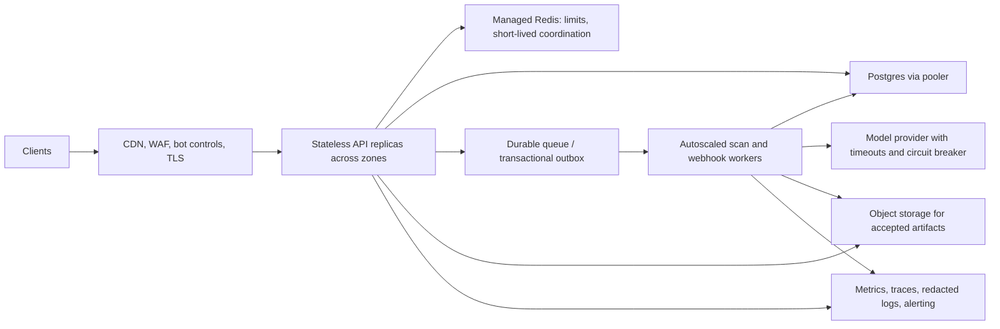

# Production scale and security architecture

This is the target architecture for scaling Shield. It is not evidence that the
current deployment has achieved any particular capacity or security level.
“Millions of users” is not a capacity target by itself: launch sizing must
specify concurrent requests, scan rate, payload size, latency SLO, regions, and
availability objectives.

## Target request path

## Required properties

- **Stateless API replicas:** sessions, rate limits, idempotency, and job state
  cannot depend on a particular process. The current progressive scan registry
  is process-local and capped; it is a safety valve, not a distributed queue.
- **Durable work:** scan upgrades, webhook deliveries, and retries are written
  to an outbox/queue before acknowledging work. Workers claim with leases,
  retry with bounded exponential backoff, and move poison work to a dead-letter
  queue. Delivery attempts are queryable per tenant.
- **Database protection:** put a pooler in front of Postgres, budget connections
  across every API/worker replica, keep transactions short, partition high
  volume event tables by time, and create retention/archival jobs. Read replicas
  serve suitable reads only; tenant writes remain transactionally isolated.
- **Abuse and overload controls:** edge and application rate limits, bounded
  request bodies/timeouts, per-tenant quotas, concurrency gates, queue depth
  limits, and explicit `429`/`503` behavior. Never queue unbounded work in RAM.
- **Isolation:** derive tenant identity only from validated credentials; apply
  tenant predicates/RLS to all tenant data; use least-privilege database roles;
  test cross-tenant denial on every endpoint family.
- **External dependencies:** enforce timeouts, bounded retries, circuit
  breakers, and redacted telemetry for model, mail, and storage providers.
  Webhook egress must resolve and block private/link-local/metadata targets on
  every redirect and defend against DNS rebinding at connection time.
- **Operations:** managed multi-zone database/cache/queue, secrets manager,
  WAF, autoscaling, dashboards and paging, tested backup restore, incident
  response, and a rollback path. Staging must match production topology.

## Current repository limits

- The API is a single Node HTTP process; no deployment/orchestrator or autoscale
  configuration is included.
- Current process-local fail-fast limits allow 64 simultaneous consumer,
  integration, or batch scan handlers and 32 assessments per API replica.
  These are protective defaults, not measured per-replica capacity targets.
- Rate limits can use Redis, but scan jobs, fraud-wave detection, and webhook
  dispatch still have process-local paths. Multi-replica correctness is not
  proven.
- Several repository adapters create independent Postgres pools. Production
  requires a connection budget and pooler before replica count is increased.
- Usage metering failures are logged best-effort; the current billing endpoint
  returns estimates, not invoices or payment collection.
- No production database/Redis deployment, failover drill, sustained load test,
  penetration test, or capacity SLO evidence is checked into this repository.

## Release gates

1. Choose a measurable workload: peak sustained and burst requests per second,
   scan mix, payload distribution, target regions, p95/p99 latency, error rate,
   and availability objective.
2. Implement durable queue/outbox and shared job state; prove idempotent worker
   recovery and tenant-scoped delivery history.
3. Deploy the production topology to staging. Run ramp, sustained, spike,
   soak, and dependency-failure tests while monitoring API, Redis, queue, and
   database saturation. Record the tested replica counts and workload.
4. Complete independent application/infrastructure security review, restore
   drill, key rotation, incident paging, and rollback rehearsal.
5. Start with a traffic-limited canary and explicit rollback thresholds. Raise
   limits only when measured headroom supports the next traffic step.

Do not describe the service as capable of millions of users until those gates
have evidence from the intended production environment.
